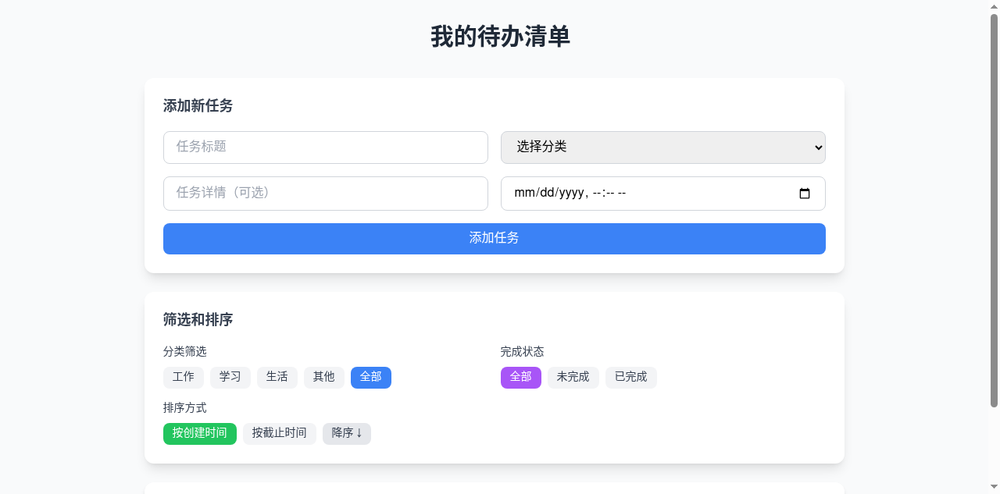
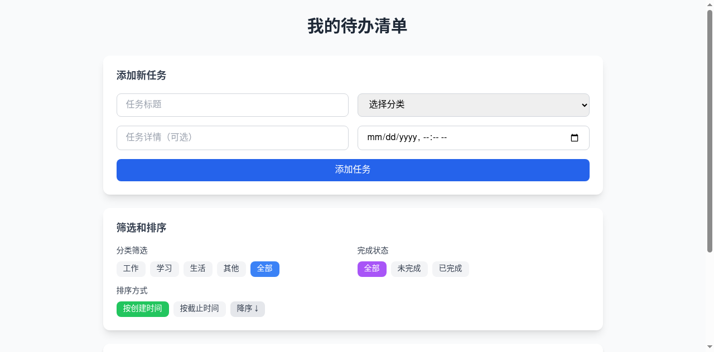
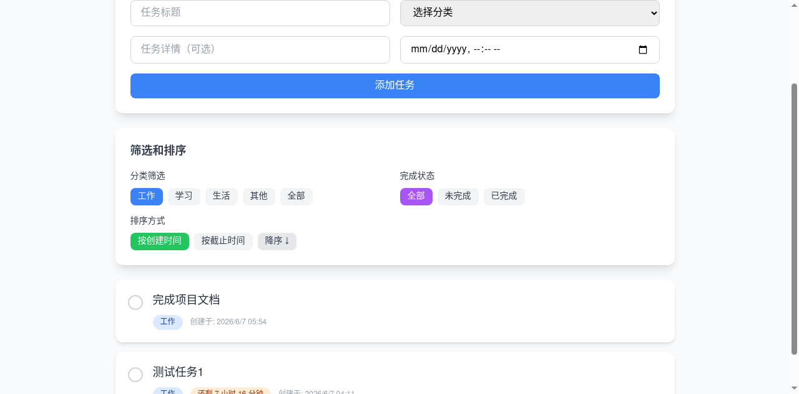
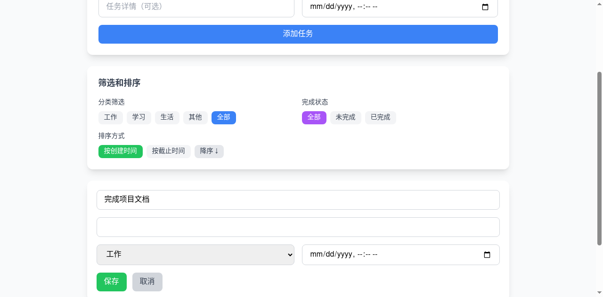
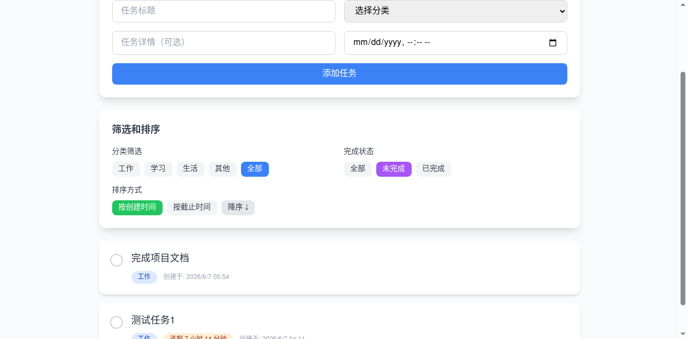

# 📝 待办清单应用

一个简洁高效的Web待办清单应用，帮助用户管理日常任务，提高工作效率。

## ✨ 功能列表

- **任务增删改查** - 完整的任务管理功能，支持创建、查看、编辑和删除任务
- **标记完成/未完成** - 点击圆形按钮快速切换任务状态，提供视觉反馈
- **分类筛选** - 支持按工作、学习、生活、其他等分类筛选任务
- **预计完成时间** - 支持设置任务截止时间，并显示剩余时间
- **完成状态筛选** - 可以查看全部、未完成或已完成的任务
- **时间排序** - 支持按创建时间或截止时间升序/降序排序
- **SQLite持久化存储** - 数据存储在本地SQLite数据库中，关闭浏览器不会丢失
- **响应式设计** - 使用Tailwind CSS构建美观的用户界面，支持各种屏幕尺寸

## 🛠️ 环境要求

- **Python**: 3.7 或更高版本
- **Node.js**: 16 或更高版本
- **npm**: 8 或更高版本
- **浏览器**: Chrome、Firefox、Safari 或 Edge 最新版本
- **无需 Ollama** - 项目不依赖AI大模型

## 📦 安装步骤

### 1. 克隆仓库

```bash
git clone <repository-url>
cd todo-app
```

### 2. 后端安装

```bash
cd backend
pip install -r requirements.txt
```

### 3. 前端安装

```bash
cd ../frontend
npm install
```

## 🚀 运行示例

### 启动后端服务

在第一个终端窗口中运行：

```bash
cd backend
python app.py
```

后端将在 http://localhost:5000 启动

### 启动前端服务

在第二个终端窗口中运行：

```bash
cd frontend
npm run dev
```

前端将在 http://localhost:3000 启动

### 打开应用

在浏览器中访问 http://localhost:3000 即可开始使用！

### 预期效果

应用启动后，您将看到：
- 顶部是应用标题"📝 我的待办清单"
- 中间是"添加新任务"表单区域，包含标题、分类、详情和截止时间字段
- 下方是"筛选和排序"区域，可以按分类、完成状态筛选，以及按时间排序
- 任务列表区域展示所有任务，每个任务有完成标记、标题、分类、剩余时间和操作按钮

## 📁 项目结构说明

```
todo-app/
├── backend/
│   ├── app.py              # Flask后端主应用，包含API路由和数据库操作
│   ├── requirements.txt    # Python依赖包列表
│   └── todos.db            # SQLite数据库文件（运行时生成）
├── frontend/
│   ├── src/
│   │   ├── App.vue         # Vue主组件，包含所有UI和业务逻辑
│   │   ├── main.js         # Vue应用入口文件
│   │   └── style.css       # Tailwind CSS样式文件
│   ├── index.html          # HTML入口文件
│   ├── package.json        # Node.js依赖配置
│   ├── vite.config.js      # Vite构建工具配置
│   ├── tailwind.config.js  # Tailwind CSS配置
│   └── postcss.config.js   # PostCSS配置
├── README.md               # 项目说明文档
└── .gitignore              # Git忽略文件配置
```

### 主要文件职责

#### [backend/app.py](file:///workspace/backend/app.py)
- **Flask应用初始化** - 设置CORS跨域支持
- **数据库管理** - SQLite数据库连接和表结构初始化
- **RESTful API** - 提供以下接口：
  - `GET /api/tasks` - 获取所有任务
  - `POST /api/tasks` - 创建新任务
  - `PUT /api/tasks/<id>` - 更新任务信息
  - `DELETE /api/tasks/<id>` - 删除任务

#### [frontend/src/App.vue](file:///workspace/frontend/src/App.vue)
- **状态管理** - 使用Vue 3 Composition API管理任务数据
- **任务列表组件** - 渲染任务卡片，支持编辑和删除
- **筛选逻辑** - 实现分类、完成状态和时间排序功能
- **时间倒计时** - 每分钟更新剩余时间显示
- **API调用** - 通过fetch与后端通信

#### [frontend/src/main.js](file:///workspace/frontend/src/main.js)
- **Vue应用挂载** - 初始化Vue应用并挂载到DOM

## 🎯 主要功能与实现方式

### 1. 任务管理
- **实现方式**: 使用Vue 3的响应式数据存储任务列表，通过CRUD API与后端交互
- **关键技术**: Composition API (ref, computed), Fetch API, Flask路由

### 2. 时间管理
- **实现方式**: 使用datetime-local输入组件，计算当前时间与截止时间的差值
- **关键技术**: Date对象, setInterval定时器, 动态颜色状态标记

### 3. 筛选与排序
- **实现方式**: 使用computed计算属性实时过滤和排序任务
- **关键技术**: Array.filter(), Array.sort(), 响应式筛选条件

### 4. 数据持久化
- **实现方式**: SQLite数据库存储任务信息，应用启动时自动创建表结构
- **关键技术**: sqlite3模块, 自动初始化数据库

## 🔧 常见问题

### 1. 端口被占用
如果提示端口5000或3000被占用，可以：
- Windows: 查找并结束占用端口的进程
- 修改app.py中的端口号，或使用不同的端口启动前端

### 2. 数据库文件损坏
如果todos.db文件损坏，可以删除该文件，重启后端服务会自动创建新数据库。

### 3. 前端无法连接后端
确保后端服务已启动，并且前端通过Vite的代理正确访问后端API。

### 4. 依赖安装失败
尝试使用国内镜像源安装：
```bash
# Python
pip install -r requirements.txt -i https://pypi.tuna.tsinghua.edu.cn/simple

# Node.js
npm install --registry=https://registry.npmmirror.com
```

## 📸 功能演示截图

### 1. 主界面


### 2. 添加任务后


### 3. 分类筛选（工作）


### 4. 编辑模式


### 5. 筛选未完成


### 功能说明
- **任务管理**：支持完整的增删改查操作
- **分类筛选**：按工作、学习、生活、其他等分类筛选
- **时间显示**：任务卡片会显示剩余时间，并用颜色标记：
  - 🟢 **青色** - 时间充足（超过24小时）
  - 🟠 **橙色** - 即将到期（24小时内）
  - 🔴 **红色** - 已过期
- **完成状态**：可以查看全部、未完成或已完成的任务

## 📄 许可证

本项目采用 MIT 许可证 - 详见 LICENSE 文件

---

祝使用愉快！如有问题，欢迎提 Issue！
