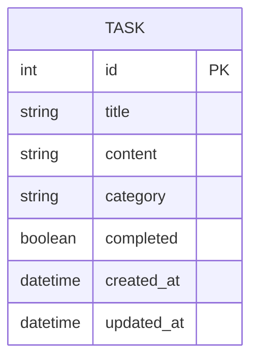

## 1. Architecture Design
```mermaid
graph TD
    A[Vue 前端] --&gt;|HTTP API| B[Python Flask 后端]
    B --&gt;|SQL| C[SQLite 数据库]
```

## 2. Technology Description
- 前端: Vue 3 + Vite + Tailwind CSS
- 后端: Python Flask
- 数据库: SQLite
- 初始化工具: Vite

## 3. Route Definitions
| Route | Purpose |
|-------|---------|
| / | 首页，任务列表页面 |
| /api/tasks | 获取所有任务 |
| /api/tasks (POST) | 创建新任务 |
| /api/tasks/:id (PUT) | 更新任务 |
| /api/tasks/:id (DELETE) | 删除任务 |

## 4. API Definitions
### 任务接口
```typescript
interface Task {
  id: number;
  title: string;
  content?: string;
  category: string;
  completed: boolean;
  created_at: string;
  updated_at: string;
}

// GET /api/tasks
interface GetTasksResponse {
  tasks: Task[];
}

// POST /api/tasks
interface CreateTaskRequest {
  title: string;
  content?: string;
  category: string;
}

// PUT /api/tasks/:id
interface UpdateTaskRequest {
  title?: string;
  content?: string;
  category?: string;
  completed?: boolean;
}
```

## 5. Server Architecture Diagram
```mermaid
graph TD
    A[API Controller] --&gt; B[Service Layer]
    B --&gt; C[Data Access Layer]
    C --&gt; D[SQLite Database]
```

## 6. Data Model
### 6.1 Data Model Definition


### 6.2 Data Definition Language
```sql
CREATE TABLE tasks (
    id INTEGER PRIMARY KEY AUTOINCREMENT,
    title TEXT NOT NULL,
    content TEXT,
    category TEXT NOT NULL,
    completed BOOLEAN DEFAULT 0,
    created_at DATETIME DEFAULT CURRENT_TIMESTAMP,
    updated_at DATETIME DEFAULT CURRENT_TIMESTAMP
);
```
